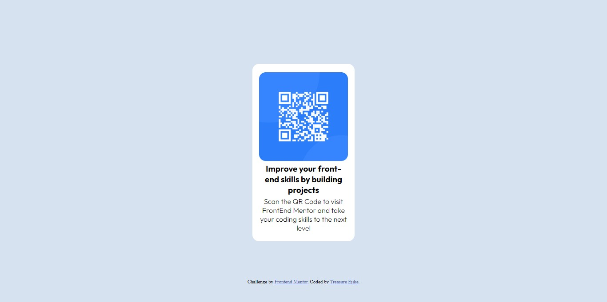
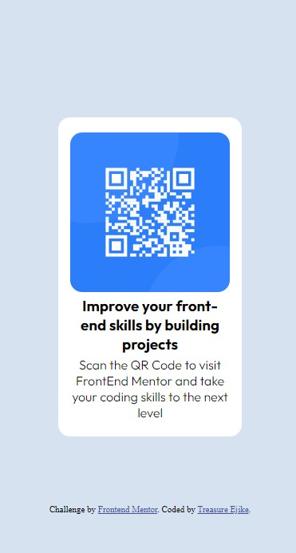

# Frontend Mentor - QR code component solution

This is a solution to the [QR code component challenge on Frontend Mentor](https://www.frontendmentor.io/challenges/qr-code-component-iux_sIO_H). Frontend Mentor challenges help you improve your coding skills by building realistic projects. 

## Table of contents

- [Overview](#overview)
  - [Screenshot](#screenshot)
  - [Links](#links)
- [My process](#my-process)
  - [Built with](#built-with)
  - [What I learned](#what-i-learned)
- [Author](#author)

## Overview

### Screenshot




### Links

- Solution URL: [https://www.frontendmentor.io/solutions/qr-code-component-_yhUKNEyzB](https://www.frontendmentor.io/solutions/qr-code-component-_yhUKNEyzB)
- Live Site URL: [https://qrcodet.netlify.app/](https://qrcodet.netlify.app/)

## My process

### Built with

- Semantic HTML5 markup
- CSS custom properties
- Flexbox
- Mobile-first workflow
- Visual Studio Code

### What I learned

I was able to use flexbox to style some elements in CSS. A case is as shown below:

```css
.container
{
    width: 230px;
    height: 400px;
    background-color: #ffffff;
    display: flex;
    flex-direction: column;
    justify-content: space-evenly;
    align-items: center;
    border-radius: 15px;
    text-align: center;
    padding: 15px;
    font-family: 'Outfit', sans-serif;
}
```

## Author

- Frontend Mentor - [@devTetra](https://www.frontendmentor.io/profile/devTetra)
- Twitter - [@tetra_codes](https://twitter.com/tetra_codes)
